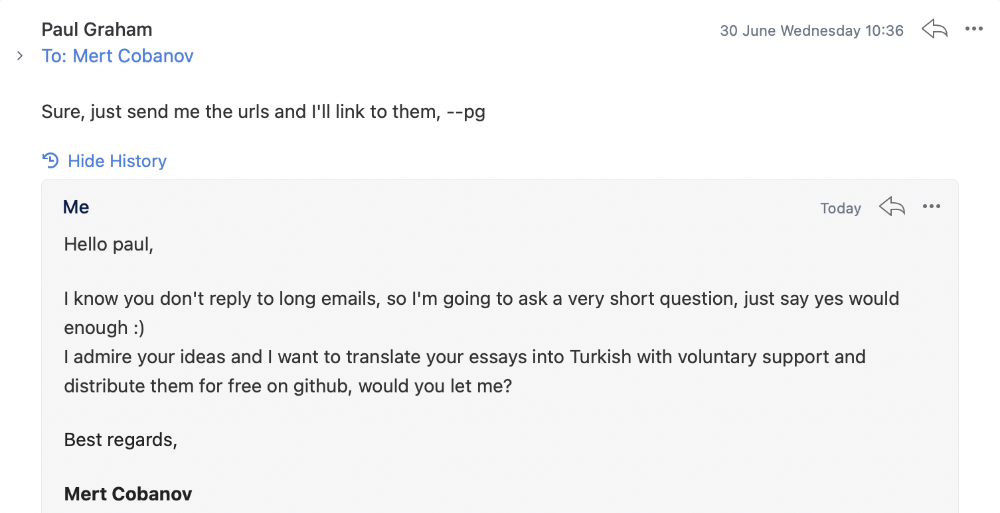

# paul-graham-turkce

**EN:** This repo is a voluntarily growing resource that publishes Turkish translations of essays on [Paul Graham's personal webpage](http://paulgraham.com/articles.html).

**TR:** Bu repo [Paul Graham'ın kişisel sayfasındaki](http://paulgraham.com/articles.html) essaylerin(denemelerin) Türkçeye çevrilmiş hallerinin yayınlandığı gönüllülük ile büyüyen bir kaynaktır.

## Translators / Çevirmenler
**EN:** Many thanks to all the translators who supported the volunteer project.

**TR:** Gönüllü projeye destek olan tüm çevirmenlere sonsuz teşekkürler.

| Translator | Count |
|-|-|
|[Mert Cobanov](https://github.com/cobanov/)| 2 |
|[Fethi Tekyaygil](https://github.com/TekyaygilFethi)|1|

## Translated Essays / Çevirilen Yazılar  
- [How to Work Hard - Nasıl Sıkı Çalışılır](articles/how-to-work-hard.md)
- [Six Principles for Making New Things - Yeni Şeyler Yaratmanın Altı İlkesi](articles/six-principles-for-making-new-thins.md)

## Upcoming Translations / Bekleyen Yazılar
- [The Bus Ticket Theory of Genius - Dehanın Otobüs Bileti Teorisi](http://paulgraham.com/genius.html)

---

## Contributions / Katkıda Bulunun

### Before You Begin Translating / Çeviriye Başlamadan Önce

In order not to translate the same essay, when you start a translation, you can specify it in the issue section. At the same time, you can come to our [Discord Channel](https://discord.gg/PY7DwAArwU) to get suggestions and communication from other friends in translation.

Aynı essay'i çevirmemek adına bir çeviriye başladığınızda bunu issue bölümünden belirtebilirsiniz. Aynı zamanda çeviride diğer arkadaşlardan öneri almak ve iletişim kurmak için [Discord Kanalımıza](https://discord.gg/PY7DwAArwU) gelebilirsiniz.

### Nasıl Katkıda Bulunurum?
İki tür katkıda bulunabilirsiniz, birincisi tahmin edebileceğiniz gibi **yeni essayleri çevirmek**, ikinici **çevirisi yapılan yazılarda bulduğunuz hataları veya daha iyi olan önerinizi** bize iletmek. Her türlü katkınıza sonuna kadar açığız. 

Projeye katkıda bulunmak oldukça kolay isterseniz Pull Request gönderin isterseniz yaptığınız çeviriyi [mail](mailto:mertcobanov@gmail.com) olarak bize iletebilirsiniz. 

### A small request / Ufak bir rica

**EN:** The translations are completely voluntary, so we kindly ask you not to send automatic translations, test the language suitability by reading aloud to yourself after translation, all submitted translations will be added to the repo after a final check.

**TR:** Çeviriler tamamen gönüllülük esaslı bu yüzden otomatik çeviri göndermemenizi rica ediyoruz, çeviri yaptıktan sonra dile uygunluğunu sesli bir şekilde kendinize okuyarak test edin, gönderilen tüm çeviriler son bir kontrolden sonra repoya eklenecektir.

## Permissions / İzinler
Bu proje için Paul Graham ile direkt temasa geçildi ve gerekli tüm izinleri bize verdiği için çok mutluyum.

## Contact / İletişim
**Mert Cobanov**

**EN:** For all your questions and suggestions within the scope of the project, you can reach me at the two addresses below.

**TR:** Proje kapsamında her türlü sorunuz ve öneriniz için aşağıdaki iki adresten ulaşabilirsiniz.

- **Twitter:** [mertcobanov](https://twitter.com/mertcobanov)
- **Mail:** [mertcobanov@gmail.com](mailto:mertcobanov@gmail.com)

